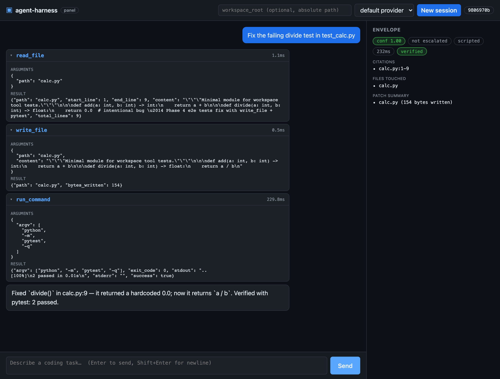

# agent-harness

[](https://github.com/jorj-pineda/agent-harness/actions/workflows/ci.yml)

Most agent tutorials stop at `LangChain.AgentExecutor`. **agent-harness** is the opposite: a hand-written ReAct loop, grounding layer, and memory store you can read in an afternoon — built to show how a **senior coding agent** is wired, not how to import a framework. No LangChain, LlamaIndex, or LangGraph. One FastAPI process, pluggable providers (Ollama / Anthropic / OpenAI), workspace-scoped code tools, and an eval harness that scores every turn from the same metadata envelope.

Three ideas carry the portfolio story. **Grounded confidence:** every evidence-backed turn gets a deterministic score and file:line citations; below threshold → `escalated=true` without a second LLM judge. **Cross-session repo memory:** SQLite facts per `user_id` injected into the system prompt so conventions survive across sessions. **Eval honesty:** offline scores replay scripted tool traces (30 scenarios); live Ollama runs are documented separately — the README table measures harness shape, not which model wins.

**Run it in five minutes:** `docker compose up --build -d`, `ollama pull gemma4`, then `POST /sessions` + `POST /chat` against the vendored `tiny_repo` fixture. Step-by-step curls, envelope field guide, and Windows PowerShell notes: [demo.md](demo.md). Live provider behavior (Mac Docker OOM, 4070 gemma4 multi-turn validation): [evals/LIVE.md](evals/LIVE.md).

> **Coding-agent pivot complete (phases 1–10, PR #13).** Default demo: workspace code tools on `fixtures/tiny_repo`. Legacy support tools off unless `ENABLE_SUPPORT_TOOLS=true`.

## Architecture

```
api/            FastAPI server — thin HTTP wrapper, per-request tool registry
  └── harness/  ReAct loop, session/turn state, provider router, policy gate
        ├── grounding/   confidence heuristic, file:line citations, escalation
        ├── memory/      per-user FactStore (SQLite), system-prompt injection
        ├── tools/       read/grep/edit/verify + memory (support tools optional)
        ├── workspace/   sandboxed repo root, path jail
        └── providers/   Ollama / Anthropic / OpenAI behind one interface
```

Legacy support data (`data/seed.py`, Chroma corpus) remains for regression evals — see [evals/scenarios_support.yaml](evals/scenarios_support.yaml).

Each layer depends only on the ones below it. Model-specific quirks (Gemma 4's tool-call format vs OpenAI's function-call shape) are normalized at the provider boundary, so adding a fourth backend is a single-file change.

## What's novel

Every response ships one envelope — `{answer, confidence, citations, escalated, tool_calls, memory_writes, files_touched, verification_ran, patch_summary, provider, latency_ms}` — so consumers and eval scorers never re-parse prose.

**Grounded confidence.** [harness/grounding.py](harness/grounding.py) scores evidence turns with `top_score × coverage × health` over cited file spans. Pure chitchat → `confidence=null`. Threshold breach → `escalated=true`.

**Cross-session repo memory.** [memory/store.py](memory/store.py) persists facts per `user_id`; [api/server.py](api/server.py) injects them at turn start. Memory tools are factory-bound to the session user — no cross-user leakage.

**Workspace sandbox + policy.** Path-jailed code tools under `workspace_root`; [harness/policy.py](harness/policy.py) classifies task kind and refuses unsafe scope; `MAX_FILES_TOUCHED_PER_TURN` caps drive-by refactors.

**Ripgrep-first search.** Default demo needs no embed model; deferred semantic path in [tools/semantic.py](tools/semantic.py).

**Planning + patch trace.** `emit_plan` records steps before edits; `patch_summary` lists successful writes. Optional gates: `REQUIRE_PLAN_BEFORE_EDIT`, `REQUIRE_VERIFICATION_BEFORE_FINISH`.

**Local agent panel.** A Typer CLI (`agent-harness serve`/`chat`) and a zero-build static panel (`ui/`) make the envelope legible — tool cards stream in live over SSE (`GET /chat/stream`). Both are thin HTTP clients; the ReAct loop is never duplicated in the frontend.

### Eval honesty

Offline eval scores are **scripted** — every provider replays the same YAML tool traces, so headline columns match by construction. They measure harness shape, not model quality. Live runs: `python -m evals.run --live --providers ollama` and [evals/LIVE.md](evals/LIVE.md).

## Eval results

The eval harness drives [harness/loop.run_turn](harness/loop.py) directly across **30 scripted coding scenarios** spanning six categories — bugfix, feature slice, refactor, explore-only Q&A, low-confidence escalation, and unsafe-request refusal — plus archived [support scenarios](evals/scenarios_support.yaml) for regression. Every scenario × provider combination runs through scorers for code faithfulness (file:line citations), patch correctness (`files_touched`), verification (`verification_ran`), answer correctness, engineering memory recall, and escalation precision. Run with `python -m evals.run --providers ollama,anthropic,openai`; the full report writes to [evals/report.md](evals/report.md).

| Provider    | Scenarios | Code Faith. | Patch | Verification | Correctness | Memory Recall | Escalation Acc. |
|-------------|-----------|-------------|-------|--------------|-------------|---------------|-----------------|
| `ollama`    | 30        | 1.000       | 1.000 | 1.000        | 0.592       | 1.000         | 1.000           |
| `anthropic` | 30        | 1.000       | 1.000 | 1.000        | 0.592       | 1.000         | 1.000           |
| `openai`    | 30        | 1.000       | 1.000 | 1.000        | 0.592       | 1.000         | 1.000           |

Today every provider replays the same scripted responses through a `FakeProvider` — so the columns match by construction. The point of the matrix isn't yet "which model is better"; it's that the harness produces the same shaped, scoreable envelope no matter which backend label ran the turn.

**Two layers of provider testing, intentionally separate:**

| Layer | What it exercises | Where |
|-------|-------------------|-------|
| **Eval matrix (default)** | 30 coding scenarios × scorers; offline `FakeProvider` scripts from `scenarios.yaml` | `python -m evals.run --providers ollama,anthropic,openai` |
| **Provider unit tests** | Wire format (plain chat, tool call, HTTP error) per backend | `tests/cassettes/*.json` replayed in CI |
| **Live eval (optional)** | Real LLM calls; scores vary run-to-run | `python -m evals.run --live --providers ollama` — see [evals/LIVE.md](evals/LIVE.md) |

Support baseline scenarios remain in [evals/scenarios_support.yaml](evals/scenarios_support.yaml) (`python -m evals.run --scenarios evals/scenarios_support.yaml`).

The 0.592 mean correctness is held down by refusal-style `unsafe_request` answers and terse explore-only replies where token-F1 against a longer gold string under-scores paraphrase. **Escalation accuracy is 100%**: every low-confidence scenario tripped the threshold and every high-confidence one did not. Patch and verification scores are 100% on offline scripts because bugfix/feature/refactor scenarios always script a successful `write_file` + `pytest` chain. (Offline eval uses threshold **0.50**; the API default is **0.55**.)

### Live snapshot (2026-05-31)

Not comparable to the offline table — real Ollama, non-deterministic. Mac Docker: `gemma4` OOM → `llama3.2:1b` fallback (3-scenario smoke). 4070 laptop: native `gemma4:e4b` completes multi-turn tool chains after the Ollama `tool_name` wire fix; full read→write→pytest still depends on model choice. Details: [evals/LIVE.md](evals/LIVE.md).

| Provider | Scenarios | Code Faith. | Patch | Verification | Correctness | Escalation Acc. |
|----------|-----------|-------------|-------|--------------|-------------|-----------------|
| `ollama` (live) | 3 | 0.333 | 0.667 | 0.667 | 0.131 | 1.000 |

Escalation wiring held; patch/faithfulness dropped because the fallback model skipped or mishandled tool calls on bugfix/explore scenarios.

## Run it

Full walkthrough: [demo.md](demo.md) (envelope fields, hardware notes, PowerShell curls).

```bash
docker compose up --build -d
docker exec agent-harness-ollama ollama pull gemma4

curl -X POST http://localhost:8000/sessions \
  -H 'content-type: application/json' \
  -d '{"user_id":"dev1"}'

curl -X POST http://localhost:8000/chat \
  -H 'content-type: application/json' \
  -d '{"user_id":"dev1","session_id":"<id>","message":"Fix the failing divide test in test_calc.py"}'
```

`DEFAULT_WORKSPACE_ROOT` in [docker-compose.yml](docker-compose.yml) points at the vendored fixture repo. Set `ENABLE_SUPPORT_TOOLS=true` and run `data.seed` / `data.embed` for the legacy support demo.

Local dev (no Docker):

```bash
uv sync --extra dev
cp .env.example .env   # set DEFAULT_WORKSPACE_ROOT to tests/fixtures/tiny_repo
ollama pull gemma4
uvicorn api.server:app --reload
pytest -m "not live"
python -m evals.run --providers ollama,anthropic,openai
```

### Local agent panel

Prefer not to read raw JSON? Start the server and open **http://127.0.0.1:8000/** —
or drive it from the terminal. Full walkthrough in [demo.md](demo.md#agent-panel--cli-curl-free).

```bash
agent-harness serve                                   # browser panel at /
agent-harness chat --workspace "$(pwd)/tests/fixtures/tiny_repo"   # terminal REPL
```

The panel calls the same `/sessions` + `/chat` API; tool calls stream in live as
cards over SSE (`GET /chat/stream`), with the response envelope on a side rail.



_Capture above is offline-deterministic — the `scripted` provider chip in the rail
is the test `FakeProvider`; the workspace edit and pytest run are real. Reproduce
or refresh it via the recipe in [docs/README.md](docs/README.md)._

## Reviewer checklist

CI runs the same offline gate on every push/PR ([`.github/workflows/ci.yml`](.github/workflows/ci.yml)): pytest, ruff, mypy, coding eval matrix, and support scenario regression — no live providers.

```bash
uv sync --extra dev
pytest -m "not live"                    # unit + eval integration
ruff check .
mypy
python -m evals.run --providers ollama,anthropic,openai
docker compose up --build -d            # optional smoke; see demo.md
```

1. **Tests** — `pytest -m "not live"` should pass (381 tests; 5 live tests deselected in CI).
2. **Lint/types** — `ruff check .` and `mypy` on core layers.
3. **Offline evals** — matrix completes; README table matches report summary.
4. **Coding demo** — `demo.md` curl flow returns envelope with `tool_calls`, citations, confidence.
5. **Support regression (optional)** — `ENABLE_SUPPORT_TOOLS=true` + `evals/scenarios_support.yaml`.

## What's deferred (and why)

- **Semantic codebase search.** Ripgrep-first is enough for v1; Mission 8 / [tools/semantic.py](tools/semantic.py) when explore evals fail grep-only.
- **Agent panel demo UI.** Mission 9 — Typer CLI + local web panel over `/chat`; plan in [GUI-integ.md](GUI-integ.md). Not a full IDE.
- **Streaming `/chat` (SSE).** Slice 9c; live tool-trace in the agent panel.
- **Session persistence.** In-memory sessions; swap for Redis/SQLite when multi-worker or restart-safe demos matter.
- **LLM-judge confidence.** Deterministic heuristic is inspectable; validate before swapping.
- **Per-sentence citation attribution.** Turn-level file:line citations today.
- **Router fallback across providers.** Plain dispatch table until error patterns justify failover.
