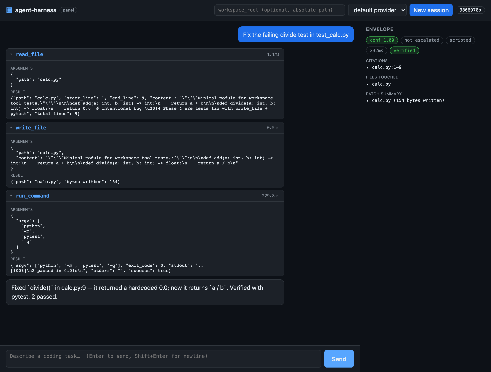

# agent-harness

**Current direction:** a practical coding harness for lower-tier local and hosted
models. See [roadmap.md](roadmap.md) for the implementation plan and
[AGENTS.md](AGENTS.md) for contributor instructions. The portfolio description and
historical results below describe the project's starting point, not demonstrated
improvements in model coding ability.

[](https://github.com/jorj-pineda/agent-harness/actions/workflows/ci.yml)

Most agent tutorials stop at `LangChain.AgentExecutor`. **agent-harness** is the opposite: a hand-written ReAct loop, grounding layer, and memory store you can read in an afternoon — built to show how a **senior coding agent** is wired, not how to import a framework. No LangChain, LlamaIndex, or LangGraph. One FastAPI process, pluggable providers (Ollama / Anthropic / OpenAI), workspace-scoped code tools, and an eval harness that scores every turn from the same metadata envelope.

Three ideas carry the portfolio story. **Observed run evidence:** completion status, check attempts, tool failures, and bounded working-tree diffs support review. The retained `confidence` field is a legacy tool heuristic, not patch correctness. **Cross-session repo memory:** SQLite facts per `user_id` injected into the system prompt so conventions survive across sessions. **Eval honesty:** offline scores replay scripted tool traces (30 scenarios); live Ollama runs are documented separately — the README table measures harness shape, not which model wins.

**Run it in five minutes:** `docker compose up --build -d`, `ollama pull gemma4`, then `POST /sessions` + `POST /chat` against the vendored `tiny_repo` fixture. Step-by-step curls, envelope field guide, and Windows PowerShell notes: [demo.md](demo.md). Live provider behavior (Mac Docker OOM, 4070 gemma4 multi-turn validation): [evals/LIVE.md](evals/LIVE.md).

> **Coding-agent pivot complete (phases 1–10, PR #13).** Default demo: workspace code tools on `fixtures/tiny_repo`. Legacy support tools off unless `ENABLE_SUPPORT_TOOLS=true`.

## Architecture

```
api/            FastAPI server — thin HTTP wrapper, per-request tool registry
  └── harness/  ReAct loop, session/turn state, provider router, policy gate
        ├── grounding/   confidence heuristic, file:line citations, escalation
        ├── memory/      per-user FactStore (SQLite), system-prompt injection
        ├── tools/       read/grep/edit/verify + memory (support tools optional)
        ├── workspace/   repo path guard and disposable workspace copies
        └── providers/   Ollama / Anthropic / OpenAI behind one interface
```

Legacy support data (`data/seed.py`, Chroma corpus) remains for regression evals — see [evals/scenarios_support.yaml](evals/scenarios_support.yaml).

Coding-only startup (`ENABLE_SUPPORT_TOOLS=false`, the default) does not import
Chroma, open support storage, or create an embedding client. It needs the selected
chat backend and SQLite personalization memory; an embedding model and a seeded
support corpus are unnecessary. Set `ENABLE_SUPPORT_TOOLS=true` to open the
legacy collection and Ollama embedding client and expose the existing SQL/RAG
tools. That mode still requires its seeded support database/corpus and embedding
backend. Custom component factories must supply both support resources when the
flag is enabled; missing resources fail during startup and allocated components
are closed. The response contract and shared coding runtime are unchanged.

Chroma remains in the package dependencies for legacy support tooling. This
change removes its import/resource initialization from coding startup; separate
installation extras are not part of this slice.

Each layer depends only on the ones below it. Model-specific quirks (Gemma 4's tool-call format vs OpenAI's function-call shape) are normalized at the provider boundary, so adding a fourth backend is a single-file change.

## What's novel

Every response ships one envelope — `{answer, confidence, citations, escalated, tool_calls, memory_writes, files_touched, verification_ran, patch_summary, provider, latency_ms}` — so consumers and eval scorers never re-parse prose.

**Legacy evidence score.** [harness/grounding.py](harness/grounding.py) retains `confidence` and its escalation threshold for API compatibility. It scores tool results with `top_score × coverage × health`; a successful file read can score 1.0 even when unrelated to the answer. Citations identify tool-reported source locations without validating the answer's claims. Neither field establishes answer or patch correctness. No evidence tool call yields `confidence=null`.

**Cross-session repo memory.** [memory/store.py](memory/store.py) persists facts per `user_id`; [api/server.py](api/server.py) injects them at turn start. Memory tools are factory-bound to the session user — no cross-user leakage.

**Workspace path guard + policy.** Code tools resolve paths under `workspace_root`; [harness/policy.py](harness/policy.py) classifies task kind and flags unsafe scope; `MAX_FILES_TOUCHED_PER_TURN` flags oversized edits after the turn. These controls do not isolate code executed by tests.

**Ripgrep-first search.** Default demo needs no embed model; deferred semantic path in [tools/semantic.py](tools/semantic.py).

**Targeted edits.** `read_file` now returns a whole-file `sha256`, including when
reading a small range of a large file. `replace_text` takes that hash and one
exact `old_text` span, refuses stale or ambiguous edits, and returns a diff.
`write_file` remains available for new files or deliberate full replacements.
File-tool edit metadata includes either operation. These mechanics have offline
regression coverage; model-level success still requires real coding evaluations.

**Managed commands and disposable copies.** Code-tool commands now run as async
processes with bounded output. Timeouts and cancellation terminate their process
group on POSIX. Command results report when stdout or stderr was truncated.
`workspace.disposable_workspace` copies a trusted fixture and compares filesystem
snapshots to find edits, new files, and deletions, including changes made by tests.
It excludes `.env` files, and commands receive a small default environment rather
than provider API keys. The five-task real evaluator uses this copy with actual
coding tools and external acceptance checks. A copy is not a security boundary:
executed code can still access the host filesystem and network. Do not run
unfamiliar repository code with this helper until an isolated execution mode exists.

**Planning + patch trace.** `emit_plan` records steps before edits;
`patch_summary` lists successful writes. When enabled,
`REQUIRE_PLAN_BEFORE_EDIT` blocks premature file edits, and
`REQUIRE_VERIFICATION_BEFORE_FINISH` gives an edited turn one bounded chance to
run a fresh check. The API response adds `verification_status`,
`completion_status`, and `completion_reason`; the older `verification_ran` flag
remains for compatibility. File count limits reject additional file-tool edits
before mutation. A passing check becomes stale after a later edit, and
version/help commands do not count as checks. Recognized checks are currently
pytest, Ruff check, and mypy. Set `PROJECT_CHECK_ARGV='["pytest","-q"]'`
and `REQUIRE_VERIFICATION_BEFORE_FINISH=true` to require that exact command
after the latest edit. The runtime includes it in the system message, and the
same setting applies to the API and real-task evaluator. Without an explicit
project check, the previous recognized-command heuristic remains in use; a
passing unrelated command may therefore appear verified.

Responses also include ordered `check_attempts` (command, outcome, exit code,
whether it matches the configured check, and whether a later edit superseded it)
and `tool_errors`. The CLI and browser panel show these beside completion status
and tool-reported edits, so an incomplete turn has a reviewable partial-work
record. These fields report observed actions, not independent proof that the
workspace is correct.

Responses also include `workspace_changes`: repo-relative files added, modified,
or deleted between the start and end of the turn. The runtime hashes the
workspace before and after each turn, so edits already present when the turn
starts are excluded unless their content changes again, and files created or
removed by commands are included. It cannot attribute a change to its author: a
concurrent edit by Jorge or another process during the turn is reported too.
Ignored directories such as `.git`, `.venv`, `node_modules`, and caches are not
tracked. When the workspace exceeds `MAX_TRACKED_FILES` or `MAX_TRACKED_BYTES`,
the report is `unavailable` with a reason instead of a partial list; set
`TRACK_WORKSPACE_CHANGES=false` to skip snapshots. Snapshot and diff-generation
time are outside the turn wall-time budget and reported model/tool latency.

`workspace_changes.diffs` adds reviewable unified text diffs to the API response,
CLI, and expandable panel entries, including turns that exhaust a budget. Each
entry has `path`, `diff`, and an optional `reason` when content is omitted. The
baseline is the working tree at turn start, including staged and unstaged user
edits, rather than Git HEAD. Git's index and stash are never used or changed.
This also works outside Git. File modes, renames, and authorship are not inferred.

Text is retained in memory from the same read as its fingerprint, with limits of
`MAX_DIFF_FILE_BYTES` (128,000 UTF-8 source bytes per file) and
`MAX_DIFF_SNAPSHOT_BYTES` (2,000,000 source bytes per snapshot). Capture is in
sorted traversal order; unchanged files also consume that budget. Combined diff
content is limited by `MAX_WORKSPACE_DIFF_BYTES` (64,000 UTF-8 bytes per turn).
Files exceeding the output allowance are omitted completely; later smaller diffs
can still be shown. Binary/non-UTF-8 files, symlink content, `.env` and `.env.*`
content, and unreadable files receive omission reasons. Empty added/deleted files
receive a descriptive entry. Other source content is not generally secret-redacted.
On platforms without `O_NOFOLLOW`, text capture is unavailable but path tracking
remains enabled. Set `MAX_WORKSPACE_DIFF_BYTES=0` to retain paths without text
capture. These are ephemeral per-turn reviews, not durable checkpoints or patches
for an automatic revert. Concurrent changes still cannot be attributed to the agent.

The panel and CLI lead with completion and check status, followed by review
evidence: working-tree diffs, check attempts, and tool failures. `completed`
records how the run ended; passing checks cover only the commands actually run,
not independent task acceptance. The panel places the legacy evidence score in
collapsed details without success coloring; the CLI labels it as a tool heuristic
and displays unavailable values as `n/a`. Numeric fields and escalation behavior
remain unchanged for existing API consumers.

The shared runtime admits one active turn per session and per overlapping
workspace root within a harness process. Roots are resolved before admission;
equal roots, parent/child roots, symlink aliases, and existing filesystem case
aliases conflict. Separate workspaces can run concurrently. Admission covers
system-message refresh, snapshots, inference, tools, and final diff generation,
even when change tracking is disabled. Conflicting requests receive the existing
response envelope with `completion_status=blocked`, `provider=policy`, and a
retry instruction. HTTP returns that envelope normally; streaming returns it in
`turn_done`. A rejected request does not alter session history or call the model,
and is not queued or retried automatically. Retry after the active turn finishes.

Tool invocation now waits for owned execution to settle on timeout/cancellation.
Synchronous workers cannot be killed, so their invocation stays active until the
worker finishes; asynchronous tools receive cancellation and finish their cleanup.
Repeated caller cancellation does not abandon that cleanup. This keeps reservations
held while an in-flight file write finishes and preserves managed subprocess
cleanup. Timeout/cancellation latency can exceed the configured deadline, and a
stuck synchronous worker can keep the workspace busy indefinitely. A timed-out
write may have changed files; review the actual diff alongside its tool error.

This guard is process-local: use one API worker for this personal-use workflow.
Other servers, editors, detached subprocesses, and direct low-level `run_turn` or
tool calls do not participate. This does not establish process isolation or
attribute every workspace change. Persistence, explicit cancellation endpoints,
repair of interrupted transcripts, idempotent retries, and safe resume remain open.

The configured runtime also caps tool attempts per turn with
`MAX_TOOL_CALLS_PER_TURN` and stops before repeating a tool call whose previous
`MAX_IDENTICAL_TOOL_CALLS` consecutive outcomes were unchanged. Rejected calls
remain in the trace with an error, and the response reports `budget_exhausted`
or `blocked` with a reason. These limits prevent further tool dispatch; they do
not meter wall time or model tokens on their own.

`MAX_TURN_WALL_SECONDS` optionally sets a turn deadline (`0` disables it).
The runtime cancels a model request at the deadline and refuses new tool calls
after it. A tool already executing may finish past the deadline, especially a
synchronous file tool; the limit does not interrupt that work. Exceeded turns
report `budget_exhausted` and retain completed edits and check history. This is
a dispatch deadline, not process isolation or a strict upper bound on response
latency. A prompt-plus-output total budget remains open.

`MAX_COMPLETION_TOKENS_PER_TURN` optionally caps model output across a turn
(`0` disables it). The runtime passes the remaining allowance as `max_tokens`
to each provider request and stops before more tools or model requests when
reported output usage spends it. Missing output usage stops a budgeted turn as
`incomplete`; a provider that exceeds the requested cap is reported as
`budget_exhausted`. Responses show observed prompt and output token totals,
with `null` where usage was not reported. Prompt tokens are known only after
a request, so this is not a strict prompt-plus-output token budget.

`MAX_CONTEXT_TOKENS` and `MAX_TOTAL_TOKENS_PER_TURN` (both `0` = disabled) are
checked before each model request using an estimated prompt size. The estimate
is the larger of a UTF-8 byte heuristic over the whole prompt and the previous
request's reported prompt tokens plus the heuristic for newer messages. If the
estimated prompt leaves fewer than `MIN_REQUEST_OUTPUT_TOKENS` of room, the turn
stops as `budget_exhausted` before sending the request; otherwise the remaining
room caps `max_tokens`. After a response, the runtime also refuses to dispatch
requested tools when the next request could not fit, because the model would
never see their results. The total budget fails closed when prompt or output
usage is unreported, and a provider response that exceeds it is reported as
such. Estimates are approximate: on one first request with local `gemma4:12b`
and the default coding tools, the estimate was 2,950 tokens against 1,781
reported. The harness does not set the model server's context length, so set
`MAX_CONTEXT_TOKENS` to the value the server actually uses. Exhausting the
context stops the turn; compaction is not implemented.

**Local agent panel.** A Typer CLI (`agent-harness serve`/`chat`) and a zero-build static panel (`ui/`) make the envelope legible — tool cards stream in live over SSE (`GET /chat/stream`). Both are thin HTTP clients; the ReAct loop is never duplicated in the frontend.

### Saved session review

The API saves session creation and each finalized runtime turn to SQLite at
`SESSION_DB_PATH` (default `data/sessions.db`). Keep this path stable across
restarts and mount it on durable storage when running in a container. The store
is separate from remembered facts and support retrieval resources.

List saved sessions with `GET /sessions?user_id=dev1` (newest first; `limit` is
1–100, default 50; `offset` defaults to 0). Inspect one with
`GET /sessions/<id>?user_id=dev1`. These routes are also available in `/docs`.
The detail response contains `schema_version`, `read_only`, the saved `session`
(transcript and turn records), and `responses` pairing each turn ID with its full
final response envelope and configured model ID. Unknown custom providers have
no configured model ID. Stored completion, checks, errors, token usage, and
bounded diffs retain their original review limitations; they do not certify the
current workspace or independently prove a patch works.

After restart, saved sessions are read-only: `/chat` and `/chat/stream` return
409 for them. Create a new session after inspecting the workspace to begin new
work. History is never restored into executable session state. While a session
is live, review shows its last committed snapshot, excluding unfinished work.
A final response is saved before HTTP success or SSE `turn_done`; a save failure
returns an error and prevents further continuation of that session, because edits
may already exist in the workspace.

This is a single-process, local review archive. The existing `user_id` ownership
checks are not authentication. The database contains model-visible conversation,
tool results, and source diffs; settings credentials and provider wire payloads
are not included. There is no automatic retention/deletion policy. Sessions are
rewritten as complete snapshots, so long histories increase storage and save cost.
Failed or externally interrupted execution also retires the live session; only
its last committed snapshot remains available. Interrupted/crashed turns, live
events, checkpoints, cancellation endpoints, safe resume,
cross-process coordination, and CLI/panel history views remain separate work.
Out-of-scope and busy rejections do not create runtime turns or archive responses.

### Eval honesty

The legacy scenario runner has two modes, neither of which executes real coding
tasks:

- **`scripted-contract`** (default): fake model responses and simulated tools
  exercise the low-level loop. Historical scenario behavior is preserved.
- **`live-model-simulated-tools`** (`--live`): real inference uses the shared
  application prompt, coding tool definitions, memory injection, and policy
  settings, but file reads, edits, and commands still return canned results.
  Unscripted coding calls fail explicitly; they never execute on disk.

The shared setup lives in `harness/runtime.py`, `harness/prompts.py`, and
`harness/config.py`; the CLI uses it through the API. Live smoke tests now use the
application escalation threshold unless `--escalation-threshold` overrides it.
Offline contracts retain their 0.50 default. Historical live results predate this
shared setup and should not be compared directly with new runs.

The application and real-task evaluator also share chat provider configuration.
`OLLAMA_HOST` and `OLLAMA_MODEL` select a local model. `OLLAMA_NUM_CTX` sets the
context length sent with each Ollama chat request, and `OLLAMA_THINK=false`
turns off model thinking. Both are unset by default, which keeps the server and
model defaults. With local `gemma4:12b`, thinking off was the difference between
most attempts failing and most succeeding in the real-task evaluation; see
`evals/BASELINES.md`. For an OpenAI-compatible
chat endpoint, set `OPENAI_COMPATIBLE_BASE_URL` and
`OPENAI_COMPATIBLE_MODEL`, plus `OPENAI_COMPATIBLE_API_KEY` if required; then
set `DEFAULT_PROVIDER=openai_compatible` for the app or pass
`--provider openai_compatible` to the evaluator. Endpoint URLs must not contain
credentials. This path uses chat completions with function tools; endpoint
compatibility should be checked with a real model before relying on it.

Reports identify these modes and explain the proxy metrics: expected-path recall
is not patch correctness, and a scripted verification flag is not a passing test
suite. The separate [five-task real evaluator](evals/real_tasks/README.md) runs
the shared application runtime with real tools on trusted disposable fixtures,
then grades the final files with external acceptance tests. It has a same-model
minimal-prompt mode. In the first local smoke comparison, `gemma4:12b` passed
`divide_zero` once in each mode; this does not establish an overall advantage.

Offline eval scores are **scripted** — every provider replays the same YAML tool traces, so headline columns match by construction. They measure harness shape, not model quality. Live runs: `python -m evals.run --live --providers ollama` and [evals/LIVE.md](evals/LIVE.md).

## Eval results

The eval harness drives [harness/loop.run_turn](harness/loop.py) directly across **30 scripted coding scenarios** spanning six categories — bugfix, feature slice, refactor, explore-only Q&A, low-confidence escalation, and unsafe-request refusal — plus archived [support scenarios](evals/scenarios_support.yaml) for regression. Every scenario × provider combination runs through scorers for code faithfulness (file:line citations), patch correctness (`files_touched`), verification (`verification_ran`), answer correctness, engineering memory recall, and escalation precision. Run with `python -m evals.run --providers ollama,anthropic,openai`; the full report writes to [evals/report.md](evals/report.md).

| Provider    | Scenarios | Code Faith. | Patch | Verification | Correctness | Memory Recall | Escalation Acc. |
|-------------|-----------|-------------|-------|--------------|-------------|---------------|-----------------|
| `ollama`    | 30        | 1.000       | 1.000 | 1.000        | 0.592       | 1.000         | 1.000           |
| `anthropic` | 30        | 1.000       | 1.000 | 1.000        | 0.592       | 1.000         | 1.000           |
| `openai`    | 30        | 1.000       | 1.000 | 1.000        | 0.592       | 1.000         | 1.000           |

Today every provider replays the same scripted responses through a `FakeProvider` — so the columns match by construction. The point of the matrix isn't yet "which model is better"; it's that the harness produces the same shaped, scoreable envelope no matter which backend label ran the turn.

**Two layers of provider testing, intentionally separate:**

| Layer | What it exercises | Where |
|-------|-------------------|-------|
| **Eval matrix (default)** | 30 coding scenarios × scorers; offline `FakeProvider` scripts from `scenarios.yaml` | `python -m evals.run --providers ollama,anthropic,openai` |
| **Provider unit tests** | Wire format (plain chat, tool call, HTTP error) per backend | `tests/cassettes/*.json` replayed in CI |
| **Live eval (optional)** | Real LLM calls; scores vary run-to-run | `python -m evals.run --live --providers ollama` — see [evals/LIVE.md](evals/LIVE.md) |

Support baseline scenarios remain in [evals/scenarios_support.yaml](evals/scenarios_support.yaml) (`python -m evals.run --scenarios evals/scenarios_support.yaml`).

The 0.592 mean correctness is held down by refusal-style `unsafe_request` answers and terse explore-only replies where token-F1 against a longer gold string under-scores paraphrase. **Escalation accuracy is 100%**: every low-confidence scenario tripped the threshold and every high-confidence one did not. Patch and verification scores are 100% on offline scripts because bugfix/feature/refactor scenarios always script a successful `write_file` + `pytest` chain. (Offline eval uses threshold **0.50**; the API default is **0.55**.)

### Live snapshot (2026-05-31)

Not comparable to the offline table — real Ollama, non-deterministic. Mac Docker: `gemma4` OOM → `llama3.2:1b` fallback (3-scenario smoke). 4070 laptop: native `gemma4:e4b` completes multi-turn tool chains after the Ollama `tool_name` wire fix; full read→write→pytest still depends on model choice. Details: [evals/LIVE.md](evals/LIVE.md).

| Provider | Scenarios | Code Faith. | Patch | Verification | Correctness | Escalation Acc. |
|----------|-----------|-------------|-------|--------------|-------------|-----------------|
| `ollama` (live) | 3 | 0.333 | 0.667 | 0.667 | 0.131 | 1.000 |

Escalation wiring held; patch/faithfulness dropped because the fallback model skipped or mishandled tool calls on bugfix/explore scenarios.

## Run it

Full walkthrough: [demo.md](demo.md) (envelope fields, hardware notes, PowerShell curls).

```bash
docker compose up --build -d
docker exec agent-harness-ollama ollama pull gemma4

curl -X POST http://localhost:8000/sessions \
  -H 'content-type: application/json' \
  -d '{"user_id":"dev1"}'

curl -X POST http://localhost:8000/chat \
  -H 'content-type: application/json' \
  -d '{"user_id":"dev1","session_id":"<id>","message":"Fix the failing divide test in test_calc.py"}'
```

`DEFAULT_WORKSPACE_ROOT` in [docker-compose.yml](docker-compose.yml) points at the vendored fixture repo. Set `ENABLE_SUPPORT_TOOLS=true` and run `data.seed` / `data.embed` for the legacy support demo.

Local dev (no Docker):

```bash
uv sync --extra dev
cp .env.example .env   # set DEFAULT_WORKSPACE_ROOT to tests/fixtures/tiny_repo
ollama pull gemma4
uvicorn api.server:app --reload
pytest -m "not live"
python -m evals.run --providers ollama,anthropic,openai
```

### Local agent panel

Prefer not to read raw JSON? Start the server and open **http://127.0.0.1:8000/** —
or drive it from the terminal. Full walkthrough in [demo.md](demo.md#agent-panel--cli-curl-free).

```bash
agent-harness serve                                   # browser panel at /
agent-harness chat --workspace "$(pwd)/tests/fixtures/tiny_repo"   # terminal REPL
```

The panel calls the same `/sessions` + `/chat` API; tool calls stream in live as
cards over SSE (`GET /chat/stream`), with the response envelope on a side rail.



_Capture above is offline-deterministic — the `scripted` provider chip in the rail
is the test `FakeProvider`; the workspace edit and pytest run are real. Reproduce
or refresh it via the recipe in [docs/README.md](docs/README.md)._

## Reviewer checklist

CI runs the same offline gate on every push/PR ([`.github/workflows/ci.yml`](.github/workflows/ci.yml)): pytest, ruff, mypy, coding eval matrix, and support scenario regression — no live providers.

```bash
uv sync --extra dev
pytest -m "not live"                    # unit + eval integration
ruff check .
mypy
python -m evals.run --providers ollama,anthropic,openai
docker compose up --build -d            # optional smoke; see demo.md
```

1. **Tests** — `pytest -m "not live"` should pass (381 tests; 5 live tests deselected in CI).
2. **Lint/types** — `ruff check .` and `mypy` on core layers.
3. **Offline evals** — matrix completes; README table matches report summary.
4. **Coding demo** — `demo.md` curl flow returns envelope with `tool_calls`, citations, confidence.
5. **Support regression (optional)** — `ENABLE_SUPPORT_TOOLS=true` + `evals/scenarios_support.yaml`.

## What's deferred (and why)

- **Semantic codebase search.** Ripgrep-first is enough for v1; Mission 8 / [tools/semantic.py](tools/semantic.py) when explore evals fail grep-only.
- **Agent panel demo UI.** Mission 9 — Typer CLI + local web panel over `/chat`; plan in [GUI-integ.md](GUI-integ.md). Not a full IDE.
- **Streaming `/chat` (SSE).** Slice 9c; live tool-trace in the agent panel.
- **Safe session resume.** SQLite retains finalized review snapshots after restart; interrupted turns, cancellation, workspace-checked resume, and client history views remain open.
- **LLM-judge confidence.** Deterministic heuristic is inspectable; validate before swapping.
- **Per-sentence citation attribution.** Turn-level file:line citations today.
- **Router fallback across providers.** Plain dispatch table until error patterns justify failover.
